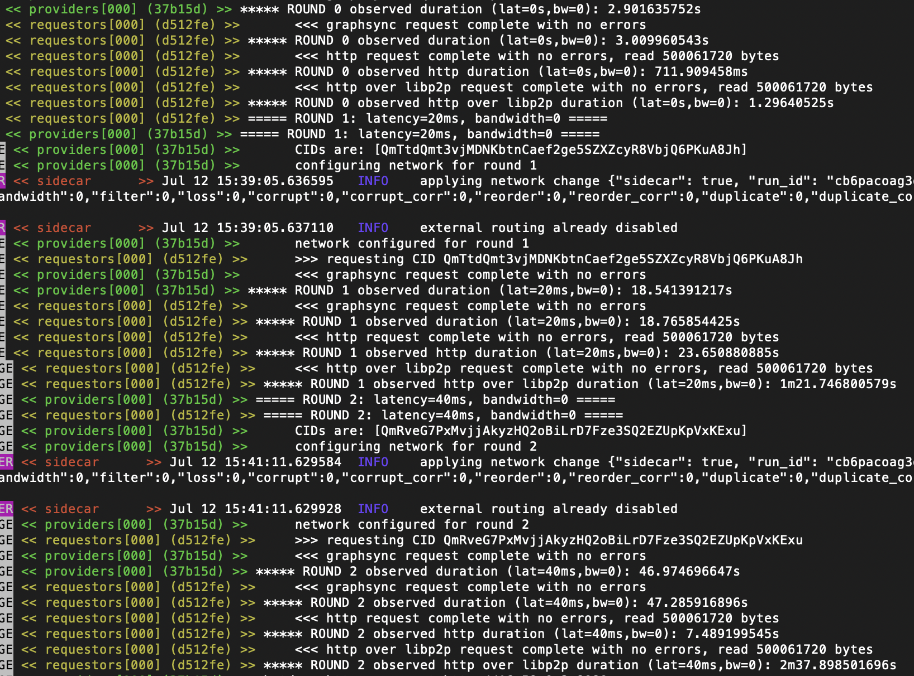
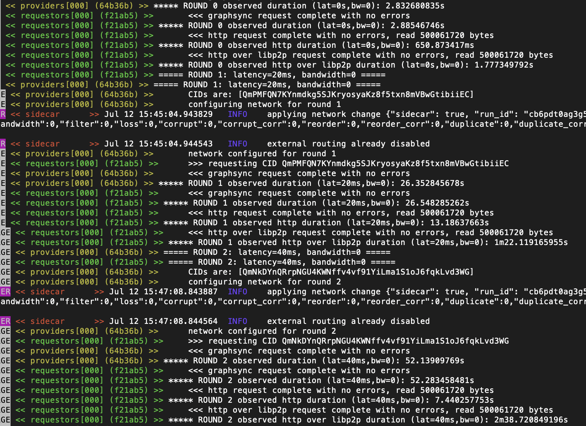

# Data Transfer Benchmark

### What This Does

This test plan measures a series of transfers between two nodes with graphsync and go-data-transfer, optionally comparing them to HTTP and HTTP over libp2p. It offers a wide variety of configurable parameters, which are documented here.

### Comparing performance

The included Testground composition demonstrates a comparison of GraphSync, HTTP, and libp2p over HTTP in transferring a 500MB CAR file under various network conditions. It uses unlimited bandwidth and three latencies, with interesting results. The big takeaway is we see the biggest performance drop comes from the switch traditional network to libp2p, at least with our go libraries. Here is a summary of the results:

- **No Latency**: GraphSync is slowest, cause under unlimited bandwidth and no latency, the performance penalty of writing a CAR file block by block comes into play. HTTP is best and HTTP over Libp2p is slightly behind. Everything overall is fast.
- **40ms roundtrip latency** (it says 20ms in pics but it’s on both sides -- half of real world cross country US): we see Graphsync do extremely well — basically on par with HTTP. Both drop significantly from zero latency. HTTP over libp2p takes a big drop and runs the slowest by 3x
- **80ms roundtrip latency** (close to real world latency conditions): this is where we see a 5x difference emerge with pure HTTP. Graphsync takes 44 seconds to transfer the file, HTTP takes 7. HTTP over libp2p tanks further, taking 2 minutes 38 seconds.

Conclusions:
HTTP seems to excel under real world conditions. What’s happening? I don’t know. But it actually drops from around 20s to 7s between 40ms & 80ms! Perhaps go’s http library (written by Google and used for downloads.google.com, so presumably written with an eye to performance) opens several connections at high latency? (essentially reverse multi-plexing).

 

### File Parameters

These parameters configure the nature of the file that is transfered:

- `size` - size of file to transfer, in human-friendly form 
   - **Default**: 1MiB
- `chunk_size` - unixfs chunk size (power of 2), controls the size of the leaves in file
   - **Default**: 20 *(or 1MB chunks)*
- `links_per_level` - unixfs links per level, controlles UnixFS DAG shape (wide vs deep) 
   - **Default**: 1024
- `raw_leaves` - should unixfs leaves be raw bytes (true), or wrapped as protonodes (false)
   - **Default**: true
- `concurrency` - number of files to construct and attempt to transfer *simultaneously*
   - **Default**: 1

Why you might want to change these:
- obviously large file sizes more closely mirror use cases in a typical filecoin data transfer work load
- the links per level, chunk size, and raw leaves allow you to expriment with different dag structures and see how graphsync performs in different conditions
- concurrency allows you to test how graphsync performs under heavy loads of attempting transfer many files simultaneously
- using car stores emulates the Lotus transfer flow, which is MUCH faster than using a single data store

### Networking Parameters

These parameters control the parameters for the network layer
- `secure_channel` - type secure encoding for the libp2p channel
   - **Default**: "noise"
- `transport` - setup libp2p to listen on either tcp or udp+quic
   - **Default**: "tcp"
- `latencies` - list of non-zero latencies to run the test under. 
   - **Default**: 100ms, 200ms, 300ms
- `no_latency_case` - also run a test case with no latency 
   - **Default**: true
- `bandwidths` - list limited bandwidths (egress bytes/s) to run the test under (written as humanized sizes). 
   - **Default**: 10M, 1M, 512kb
- `unlimited_bandwidth_case` - also run a test case with unlimited latency
   - **Default**: true

Why you might want to change these:
- we may pay a penalty for the cost of transfering over secure io
- bandwidth and latency parameters allow you to test graphsync under different network conditions. Importantly, these parameters generate a new test case for each instance, in a combinatorial form. So, if you you do two latencies and two bandwidths, you will get 4 rounds. And if concurrency is >1, each round with have more than one transfer

### Graphsync Options

The parameters control values passed constructing graphsync that may affect overall performance. Their default values are the same default values is no value is passed to the graphsync constructor

- `max_memory_per_peer` - the maximum amount of data a responder can buffer in memory for a single peer while it waits for it to be sent out over the wire
   - **Default**: 16MB
- `max_memory_total` - the maximum amount of data a responder can buffer in memory for *all peers* while it waits for it to be sent out over the wire
   - **Default**: 256MB
- `max_in_progress_requests` - The maximum number of requests Graphsync will respond to at once. When graphsync receives more than this number of simultaneous in bound requests, those after the first six (with a priotization that distributes evenly among peers) will wait for other requests to finish before they beginnin responding.
   - **Default**: 6

These performance configuration parameters in GraphSync may cause bottlenecks with their default values. For example if the `concurrency` parameter is greater than 6, the remaining files will block until graphsync finishes some of the first 6. The buffering parameters may artificially lower performance on a fast connection. In a production context, they can be adjusted upwards based on the resources and goals of the graphsync node operator

### HTTP Comparison Parameters

The parameters allow you to compare graphsync performance against transfer of the same data under similar conditions over HTTP

- `compare_http` - run an HTTP comparison test
   - **Default**: true
- `compare_libp2p_http` - run an HTTP comparison test, but use HTTP running on top of a libp2p connection
   - **Default**: true

### Diagnostic Parameters

These parameters control what kind of additional diagnostic data the test will generate

- `memory_snapshots` - specifies whether we should take memory snapshots as we run. Has three potention values: *none* (no snapshots), *simple* (take snapshots at the end of each request) and *detailed* (take snap shots every 10 blocks when requests are executing). Note: snapshoting will take a snapshot, then run GC, then take a snapshot again. *detailed* should not be used in any scenario where you are measuring timings
   - **Default**: none
- `block_diagnostics` - should we output detailed timings for block operations - blocks queued on the responder, blocks sent out on the network from the responder, responses received on the requestor, and blocks processed on the requestor
   - **Default**: false

### Jaeger Parameters

These parameters will collect traces to a running Jaeger instance. Note that
this is easiest to setup with the `local:exec` runner and fairly difficult with `local:docker` or `cluster:k8s`

- `jaeger_collector_endpoint` - jaeger HTTP collector endpoint
- `jaeger_username` - if using HTTP collector, username to authenticate with
- `jaeger_password` - if using HTTP collector, password to authenticate with
- `jaeger_agent_host` - jaeger Thrift UDP agent host
- `jaeger_agent_port` - jaeger Thrift UDP agent port
